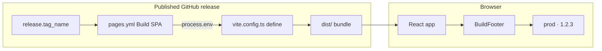

# Build version and environment in footer

opengd77-map displays **build environment** and **build version** in a muted
page footer so support and contributors can tell at a glance which build a
browser tab is running. Values are baked in at **build time** via Vite `define`
in `vite.config.ts`. Local dev builds fall back to `"local"` without any
configuration.

Pair with [git-workflow](../git-workflow/SKILL.md) for releases and
[feature-docs](../feature-docs/SKILL.md) when documenting the feature under
`docs/build/`.

---

## Concepts

| Term | Meaning |
| --- | --- |
| **`BUILD_ENV`** | Deployment environment name. Today: `local` or `prod`. |
| **`BUILD_VERSION`** | Version shown beside `BUILD_ENV`. |
| **Vite `define`** | Build-time constant replacement — `__BUILD_ENV__` and `__BUILD_VERSION__` become string literals in the bundle. |

### Values by environment

This repo has **no dev/qa/staging** deploy targets today (see
[docs/build/README.md](../../../docs/build/README.md)). Extend this table if
that changes.

| Environment | `BUILD_ENV` | `BUILD_VERSION` |
| --- | --- | --- |
| local | `local` | `local` |
| prod (GitHub Pages from published release) | `prod` | SemVer from release tag, e.g. `1.2.3` (strip leading `v`) |

**Display format:** muted footer text, e.g. `prod · 1.2.3` or `local · local`.

---

## Recommended layout

| Path | Role |
| --- | --- |
| `vite.config.ts` | Reads `process.env.BUILD_ENV` / `BUILD_VERSION`; sets `define` |
| `src/vite-env.d.ts` | Declares `__BUILD_ENV__` and `__BUILD_VERSION__` globals |
| `src/components/BuildFooter.tsx` | Renders `{__BUILD_ENV__} · {__BUILD_VERSION__}` |
| `src/App.tsx` | Mounts `BuildFooter` on every route |
| `.github/workflows/pages.yml` | Passes env vars to `npm run build` |
| `docs/build/README.md` | Document deploy-time injection |

---

## Implementation checklist

When adding or changing build info:

- [ ] `vite.config.ts` reads `BUILD_ENV` / `BUILD_VERSION` from `process.env` with `local` defaults
- [ ] `define` block sets `__BUILD_ENV__` and `__BUILD_VERSION__` via `JSON.stringify`
- [ ] `src/vite-env.d.ts` declares the globals
- [ ] `BuildFooter` component renders muted footer text
- [ ] `pages.yml` sets `BUILD_ENV=prod` and `BUILD_VERSION` from `github.event.release.tag_name`
- [ ] Update [docs/build/README.md](../../../docs/build/README.md) (build-time vars)
- [ ] Smoke-test locally (footer shows `local · local`)
- [ ] Smoke-test prod build (`BUILD_ENV=prod BUILD_VERSION=v1.2.3 npm run build`)
- [ ] Smoke-test after publishing a release (footer shows `prod · <semver>`)

---

## 1. Vite `define` in `vite.config.ts`

```typescript
const buildEnv = process.env.BUILD_ENV || 'local';
const buildVersion = (process.env.BUILD_VERSION || 'local').replace(/^v/, '');

export default defineConfig({
  // ...
  define: {
    __BUILD_ENV__: JSON.stringify(buildEnv),
    __BUILD_VERSION__: JSON.stringify(buildVersion),
  },
});
```

Strip the leading `v` from release tags so the footer matches the previous
`prod · 1.2.3` format.

---

## 2. Type declarations

```typescript
// src/vite-env.d.ts
declare const __BUILD_ENV__: string;
declare const __BUILD_VERSION__: string;
```

---

## 3. Footer rendering

Match existing UI patterns — `system-ui`, dark background, `--muted` colour.

```tsx
export default function BuildFooter() {
  return (
    <footer className="build-footer" aria-label="Build info">
      {__BUILD_ENV__} · {__BUILD_VERSION__}
    </footer>
  );
}
```

Style with muted, small type (e.g. `font-size: 0.75rem; color: var(--muted)`).
Do not make build info prominent — it is for debugging, not branding.

---

## 4. `pages.yml` injection

The workflow passes env vars to the build step:

```yaml
- name: Build SPA
  env:
    BUILD_ENV: prod
    BUILD_VERSION: ${{ github.event.release.tag_name }}
  run: npm run build
```

Vite reads these at build time via `process.env` in `vite.config.ts`. No `sed`
or placeholder sentinels in source.

### Tag source

Workflow triggers on `release: types: [released]`. `github.event.release.tag_name`
is the tag (e.g. `v1.0.0`). Strip `v` in `vite.config.ts` for display.

---

## 5. Local development

| Scenario | Expected footer |
| --- | --- |
| `npm run dev` | `local · local` |
| `npm run build` (no env) | `local · local` |
| `BUILD_ENV=prod BUILD_VERSION=v1.2.3 npm run build && npm run preview` | `prod · 1.2.3` |

No workflow or env vars needed for local work.

---

## Data flow



---

## Edge cases and future extensions

- **Missing env vars** — footer shows `local · local` (defaults in `vite.config.ts`).
- **No staging yet** — unlike MyCare, there is only prod on Pages. If PR previews
  or a staging host are added later, extend the values table and pass a
  different `BUILD_ENV` in that workflow.
- **Prerelease tags** — `v1.2.3-rc.1` works as-is; display the tag minus `v`.
- **Legacy static tools** — `site/build-info.js` with `sed` placeholders is
  retired when `site/` is deleted in SPA migration Ticket C.

---

## Documentation

When shipping build-info changes:

1. Update the **Build-time variables** subsection in
   [docs/build/README.md](../../../docs/build/README.md).
2. Note footer verify in post-deploy checklist: open the live site and confirm
   `prod · <semver>` matches the release just published.
