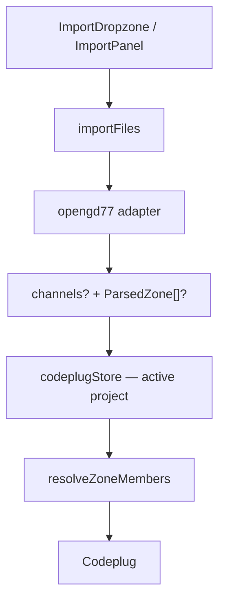

# Import

How CPS export files enter the app and become internal [codeplug models](../data-model/README.md).

**Tracking:** [codeplug-tool#7](https://github.com/pskillen/codeplug-tool/issues/7)

## Problem

Import was hard-wired to OpenGD77 CSV inside the channel map. This refactor introduces a format registry, OpenGD77 as the first adapter, and a central store that resolves vendor names to internal ids.

## Implementation status

| Area | Status | Notes |
| --- | --- | --- |
| Internal models | Shipped | [`src/models/codeplug.ts`](../../../src/models/codeplug.ts) |
| OpenGD77 adapter | Shipped | Channels.csv + Zones.csv |
| Format registry | Shipped | OpenGD77 only; room for more brands |
| Multi-file + directory import UI | Shipped | [`ImportDropzone`](../../../src/components/ImportDropzone/ImportDropzone.tsx) / [`ImportPanel`](../../../src/components/ImportPanel/ImportPanel.tsx) |
| Name → id resolution | Shipped | Store reducer + [`src/lib/codeplug.ts`](../../../src/lib/codeplug.ts) |
| LocalStorage persistence | Shipped | [#9](https://github.com/pskillen/codeplug-tool/issues/9) — [persistence/](../persistence/) |
| Multi-project import | Shipped | Home creates project; map updates active — [codeplug-project/](../codeplug-project/) |

## Documentation map

| Doc | Contents |
| --- | --- |
| [data-model/README.md](../data-model/README.md) | Entity definitions (canonical) |
| [opengd77.md](opengd77.md) | OpenGD77 CSV columns, classification, skip/error behaviour |
| [genericise-import-progress.md](genericise-import-progress.md) | Execution log |
| [genericise-import-outstanding.md](genericise-import-outstanding.md) | Discovered debt |
| [persistence/README.md](../persistence/README.md) | LocalStorage envelope |
| [codeplug-project/README.md](../codeplug-project/README.md) | Project wrapper + CRUD |

## Architecture

## Code anchors

| Symbol | File | Role |
| --- | --- | --- |
| `importFiles` | `src/lib/import/index.ts` | Read files, classify, parse |
| `collectFilesFromDataTransfer` | same | Folder drag-and-drop |
| `opengd77Adapter` | `src/lib/import/opengd77/adapter.ts` | `detectKind`, delegates to parse |
| `parseChannels` / `parseZones` | `src/lib/import/opengd77/parse.ts` | CSV → models / raw zones |
| `parseCsv` | `src/lib/csv.ts` | Generic CSV tokenizer |
| `CodeplugProvider` | `src/state/codeplugStore.tsx` | Central state + import merge |

## Import UI behaviour

- **Drop target:** accepts multiple `.csv` files or a whole folder (`webkitdirectory` + `webkitGetAsEntry` for folder drops).
- **Recognised:** `Channels.csv` and `Zones.csv` (by filename or header signature).
- **Skipped:** unknown CSVs (e.g. `Contacts.csv`) — listed, not errors.
- **Errors:** parse failures (missing required columns, empty file).
- **Clear all (map):** empties the **active** project's codeplug; project record kept.
- Home import creates a **new** codeplug project and opens the map.
- Channels and zones can be imported together (directory) or sequentially.

## Persistence

Projects envelope persisted to LocalStorage on every store change — see [persistence/README.md](../persistence/README.md). Import on home → new project; import on map → active project.

## Manual verify

1. `npm run dev` → home → **Import codeplug** with `Channels.csv` — map opens with markers.
2. Import `Zones.csv` on the map — hulls appear.
3. Import a whole export folder — both recognised; other files skipped.
4. Hard refresh — projects and data restored from LocalStorage.
5. Home → import a second codeplug — two projects listed; **Open** switches map context.
6. **Clear all** on map — active project emptied; project still listed on home.

## Related

- [OpenGD77 adapter](opengd77.md)
- [Data model](../data-model/README.md)
- [Map hub](../map/README.md)
