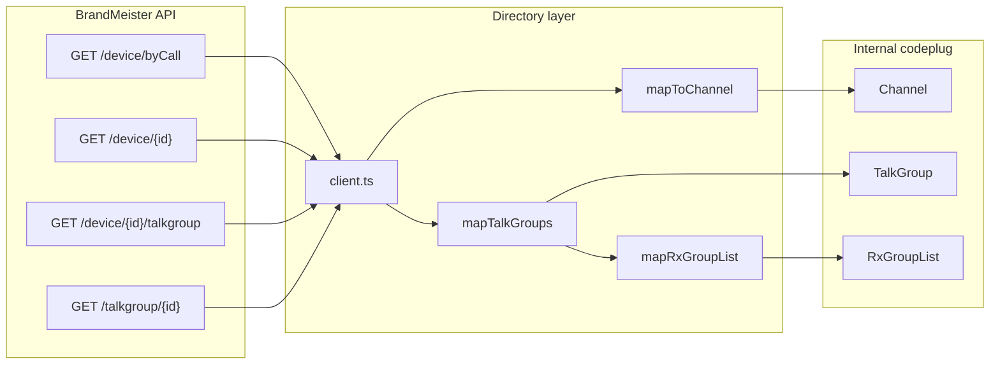

# BrandMeister repeater directory

**Purpose:** Contributor guide to how codeplug-tool looks up DMR repeaters on the BrandMeister network (Halligan API v2), maps them into the internal codeplug model, and lets operators verify or correct local data.

**Tracking:** [codeplug-tool#167](https://github.com/pskillen/codeplug-tool/issues/167)  
**Hub:** [repeater-directories README](README.md)  
**API reference:** [reference/brandmeister](../../reference/brandmeister/README.md)

---

## Code anchors

| Area | Path |
| --- | --- |
| API client + cache | `src/lib/repeaterDirectories/brandmeister/client.ts`, `cache.ts` |
| Device → channel mapper | `src/lib/repeaterDirectories/brandmeister/mapToChannel.ts` |
| Static TG resolution | `src/lib/repeaterDirectories/brandmeister/mapTalkGroups.ts` |
| RX list builder | `src/lib/repeaterDirectories/brandmeister/mapRxGroupList.ts` |
| Bundle orchestration (search-add) | `src/lib/repeaterDirectories/brandmeister/orchestrateAdd.ts` |
| Channel / RX diffs | `channelDiff.ts`, `rxListDiff.ts`, `entityDiff.ts` |
| RX list correction plan | `prepareRxListCorrection.ts` |
| Store mutations | `addBrandMeisterRepeaterBundle`, `applyBrandMeisterRxListCorrection` in `src/lib/codeplugMutations.ts` |
| Search-add UI | `src/components/BrandMeisterSearch/` → route `/channels/add-from-brandmeister` |
| Edit pre-fill | `src/components/BrandMeisterChannelLookup/` on DMR channel editor |
| Verify UI | `src/components/BrandMeisterVerify/` (channel, talk group, RX list) |
| RGL members preview | `src/components/report/RxGroupListMembersTable.tsx` on channel detail |
| Provenance | `meta.repeaterDirectory` with `sourceId: 'brandmeister'`, `remoteListingId` = device id |

All vendor-specific field rules stay under `src/lib/repeaterDirectories/brandmeister/` — the internal model (`Channel`, `TalkGroup`, `RxGroupList`) stays format-agnostic.

---

## Data flow

**Frequency inversion:** On the wire, device `tx` / `rx` are repeater-side MHz. The channel model stores operator RX/TX in Hz, so import maps device `tx` → channel `rxFrequency` and device `rx` → channel `txFrequency`.

**Provenance:** After add or verify-apply, `channel.meta.repeaterDirectory` records the BrandMeister device id so later verify can call `GET /device/{id}` without re-searching by callsign.

---

## Operator flows

### Flow A — Search and add

**Route:** `/channels/add-from-brandmeister`

1. Operator searches by callsign or numeric device id.
2. Picks a device; mapper builds a `ChannelInput` (frequencies, colour code, location, comment, provenance).
3. Optional checkbox: **Create talk groups and RX group list** (Flow B) — adds static TGs from `GET /device/{id}/talkgroup` and a repeater-named RX list, then links the new channel.

### Flow A (edit) — Pre-fill

**Route:** `/channels/:id/edit` (DMR section)

**Look up** (`BrandMeisterChannelLookup`) searches BrandMeister and patches the form draft (frequencies, CC, location, etc.) without saving until the operator clicks **Save**.

### Flow B — Talk groups and RX list

Triggered from search-add (checkbox) or built during verify correction.

**Talk group identity:** Static entries are matched to existing local talk groups by **DMR ID** (`TalkGroup.number`), not by display name. Leading zeros are normalised (`09` = `9`). Names are not compared for membership.

**Create rule:** A new `TalkGroup` is created only when no local talk group exists for that DMR ID. New groups default to name `TG {id}`.

**RX list:** `staticTalkgroupSlots` reads each static entry’s `talkgroup` + `slot` (`1` or `2`). Members are `memberRefs` with UUID talk group ids and optional per-member `timeslot`. List name defaults to `{callsign} RX`.

### Flow C — Verify and correct

| Surface | Component | What it compares |
| --- | --- | --- |
| Channel detail | `BrandMeisterVerify` | Device vs channel fields; optional RX list correction |
| Channel edit | `BrandMeisterVerify` + `editBindings` | Same diff; patches form draft and RGL selector |
| Talk group detail | `BrandMeisterTalkGroupVerify` | Catalogue name from `GET /talkgroup/{id}` vs local name (name-only on this screen) |
| RX list detail | `BrandMeisterRxListVerify` | Static TG set vs list membership (ID + timeslot) |

**Channel verify lookup order**

1. If `meta.repeaterDirectory.remoteListingId` is set for BrandMeister → `GET /device/{id}`.
2. Else search `GET /device/byCall?callsign=…` and auto-pick when frequencies/CC match.

**RX list correction** (channel verify, when static TGs differ):

1. Per-TG diff rows: missing member, extra member, or **timeslot mismatch** (names ignored).
2. Operator opts in with **Apply RX group list correction**.
3. **Update current list** or **Create new RX group list** (editable name; existing list names shown as hint).
4. `applyBrandMeisterRxListCorrection` atomically: create missing TGs by DMR ID → set `memberRefs` from static slots → update or create RX list → optionally link channel when creating a new list on an existing saved channel.

On **channel edit**, `editBindings` apply channel patches to form state and set `rxGroupListId` after simulating the mutation (so the dropdown shows the new list id before save).

### Channel detail — RX list preview

Under **DMR → RX group list**, channel detail embeds `RxGroupListDetailValue`: link to the full RX list page plus a compact members table (name, type, timeslot override). Same table component powers **RX list detail → Members**.

---

## Manual verify

Use a known BrandMeister repeater (e.g. GB7HH, device id `235226` from the reference doc).

1. **Search-add:** `/channels/add-from-brandmeister` → add with TG/RX checkbox → confirm talk groups dedupe by DMR ID and RX list name `{callsign} RX`.
2. **Edit pre-fill:** Open a DMR channel → **Look up** → fields update in the form.
3. **Channel verify:** Channel detail → **Check BrandMeister** → diff modal; apply selected channel fields.
4. **RX correction:** Deliberately wrong timeslot on an RGL member → verify shows timeslot row → apply update or create new list.
5. **Channel edit verify:** Edit page → **Check BrandMeister** → apply without save → confirm form + RGL dropdown update.
6. **RGL preview:** Channel detail DMR section shows member table with timeslots.
7. **RX list verify:** RX list detail → **Check BrandMeister** (requires a channel on that list with BrandMeister provenance).

Automated tests: `src/lib/repeaterDirectories/brandmeister/*.test.ts`.

---

## Known gaps

- `GET /device/{id}/action/getRepeater` requires dashboard auth — not used; device record supplies frequencies/CC.
- Dynamic TG subscriptions are not exposed on the static `/talkgroup` endpoint — Flow B uses static TGs only.
- Talk group verify still offers catalogue **name** sync (separate from RX list ID matching).
- Import into shared reference library remains [#30](https://github.com/pskillen/codeplug-tool/issues/30).

---

## Related

- [brandmeister-progress.md](brandmeister-progress.md) — execution log
- [brandmeister-outstanding.md](brandmeister-outstanding.md) — discovered debt
- [BrandMeisterVerify component doc](../../../src/components/BrandMeisterVerify/BrandMeisterVerify.md)
- [BrandMeisterSearch component doc](../../../src/components/BrandMeisterSearch/BrandMeisterSearch.md)
